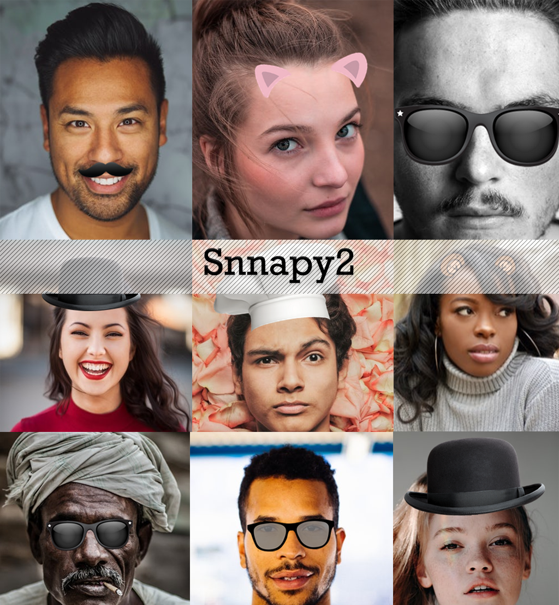
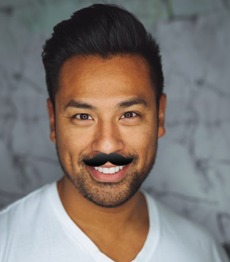

# Snappy 2
## Introduction
Detect faces in photos and draw overlay images on it, the overlay drawn using neural network that detect key-points in face.<br>
- draw glasses
- draw mustache
- draw hat
- draw ears
- draw key points
- draw any overlay




*This version 2 beta built on previous version snappy v1 beta*

## Classes
1. **Snappy2**: main class object and one place for all snappy library control.
2. Detector: if you want to use the library in more advanced way by getting key points dictionary.
3. FacePainter: helper to draw on top of images based on received key points dictionary.

## Requirements
Download the required libraries for code using following terminal command:
- Option 1: install requirements directly
```
cd requirements
pip install -r requirements.txt
```
- Option 2: Import anaconda environment
```
cd requirements
conda env create -f snappy.yml
soruce activate snappy.yml
```
if you don't have anaconda download from [here](https://anaconda.org/)

## Code Examples (How to)
- Draw Mustache on face *(3 lines)*
 ```
 human_image = Image.open('<file_path>')

 snappy2 = Snappy2()
 snappy2.set_mustache(human_image, mus_index=0)
 ```
 

- Draw glasses on face *(3 lines)*
```
human_image = Image.open('<file_path>')

snappy2 = Snappy2()
snappy2.set_glasses(human_image, gls_index=0)
```


- Draw ears on face *(3 lines)*
```
human_image = Image.open('<file_path>')

snappy2 = Snappy2()
snappy2.set_ears(human_image, gls_index=0)
```


For more examples and advanced use check (test/**Demo.py**)

# Imports
```
import Snappy2 as snappy2
```

## Contributors
1- Ahmad Barqawi (Developer)<br/>
2- Contribute and add your name here<br/>

## Disclaimer
This library use photos available free in the internet, if any of example photos have license please contact the library owner directly to add the license or delete the content. Expected response on requests within 3 days.
- Overlays provided from freepik
- Faces in the video provided from unsplash free data set

License
-------
    The MIT License (MIT)

    Copyright (c) 2017 Ahmad Barqawi (github.com/Barqawiz)

    Permission is hereby granted, free of charge, to any person obtaining a copy
    of this software and associated documentation files (the "Software"), to deal
    in the Software without restriction, including without limitation the rights
    to use, copy, modify, merge, publish, distribute, sublicense, and/or sell
    copies of the Software, and to permit persons to whom the Software is
    furnished to do so, subject to the following conditions:

    The above copyright notice and this permission notice shall be included in all
    copies or substantial portions of the Software.
