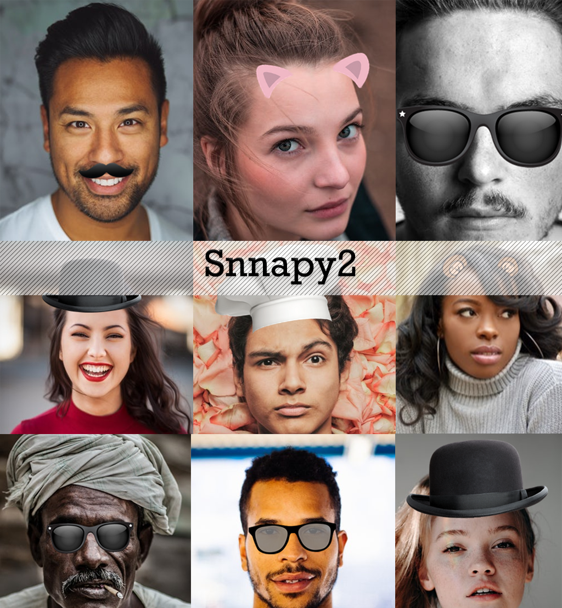
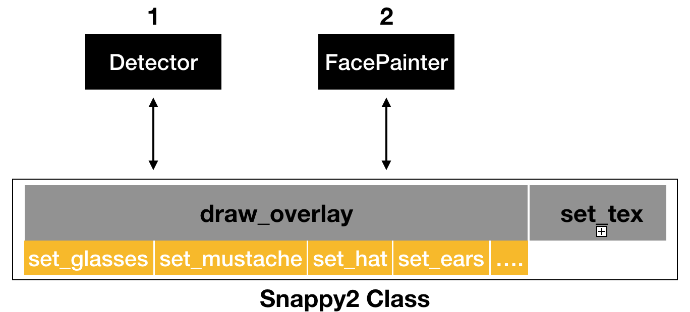
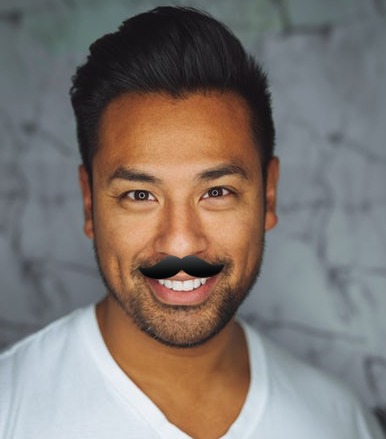
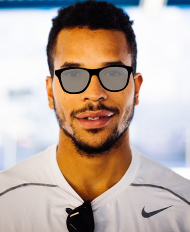
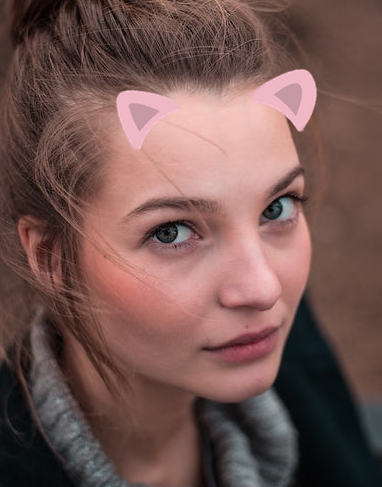

# Snappy 2

## Introduction
Snappy2 makes it easy to draw fun overlays on images. It uses a neural network to detect face keypoints and then uses those key points to draw overlays such as glasses, mustaches, hats, ears, and custom overlays on the face. The library is easy to use and comes with several code examples to get started quickly with a variety of drawing options:<br>
- draw glasses
- draw mustache
- draw hat
- draw ears
- draw any overlay
- draw text



For GPU optimized version, download the code from [this brunch.](https://github.com/Barqawiz/Snnapy2-Filters/tree/dlib)

## Classes
1. **Snappy2**: main class object and one place for all snappy library control.
2. Detector: provides advanced functionality for getting face keypoints.
3. FacePainter: helper functions for drawing on top of images based on the received keypoints.



## Requirements
### Pip setup
Snappy2 can be easily installed using pip:
```
pip install snappy2
```

### Github setup
Download the required libraries for code using following terminal command:
- Install the requirements:
```
cd requirements
pip install -r requirements.txt
cd ..
```
- Run the demo:
```
python Demo.py
```

## Imports
```
from snappy2 import Snappy2
```

## Code Examples (How to)
- Draw Mustache on face *(3 lines)*
 ```
 snappy = Snappy2()
 
 human_image = snappy.load_image('<file_path>')
 snappy.set_mustache(human_image, mus_index=0)
 ```
 

- Draw glasses on face *(3 lines)*
```
snappy = Snappy2()

human_image = snappy.load_image('<file_path>')
snappy.set_glasses(human_image, gls_index=0)
```



- Draw ears on face *(3 lines)*
```
snappy = Snappy2()

human_image = snappy.load_image('<file_path>')
snappy.set_ears(human_image, gls_index=0)
```


For more examples and code details use check (**Demo.py**)

## Disclaimer
This library utilizes photos that are freely accessible on the web. If any of the example photos have licensing restrictions, please reach out to the library owner directly for clarification or removal.
- The overlays sourced from Freepik.
- The faces from the Unsplash free data set.

License
-------
    The MIT License (MIT)

    Copyright (c) 2017 Ahmad Barqawi (github.com/Barqawiz)

    Permission is hereby granted, free of charge, to any person obtaining a copy
    of this software and associated documentation files (the "Software"), to deal
    in the Software without restriction, including without limitation the rights
    to use, copy, modify, merge, publish, distribute, sublicense, and/or sell
    copies of the Software, and to permit persons to whom the Software is
    furnished to do so, subject to the following conditions:

    The above copyright notice and this permission notice shall be included in all
    copies or substantial portions of the Software.
